# Speech To Text Transcription in Unreal Engine (RobCoG VR)

## Different Approaches
* [Sphinx Based Plugin](https://github.com/Srikanth635/IAI_USEMLOG_REST_Speech/edit/master/README.md#sphinx-based-plugin)
* [Whisper Speech-to-Text Unreal Engine Plugin](https://github.com/Srikanth635/IAI_USEMLOG_REST_Speech/edit/master/README.md#whisper-speech-to-text-unreal-engine-plugin)
* [REST API (Unreal Engine) – Flask](https://github.com/Srikanth635/IAI_USEMLOG_REST_Speech/edit/master/README.md#rest-api-unreal-engine--flask)

<h2>Sphinx Based Plugin</h2>

GIT : [Sphinx Unreal Engine Plugin](https://github.com/shanecolb/sphinx-ue4)

_Acoustic Model_ : Contains a statistical representation of the distinct sounds for every word in vocab and each sound corresponds to a phoneme
_Language Model_ : Contains list of words and their probability of occurrence in sequence

  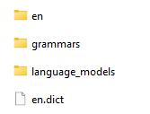
  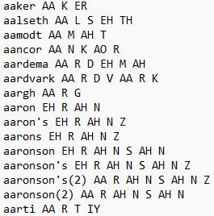

<b>
Fig. (a) Folder structure inside content/model directory (b) Phonemes inside the vocab
</b>

  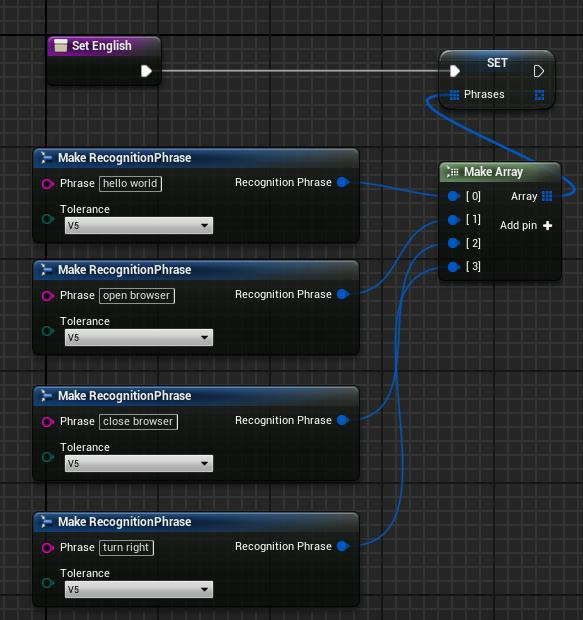
  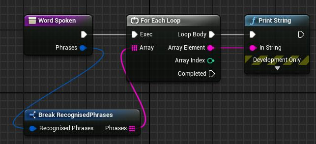

<b>
Fig. (a) Setting Probability tolerance for Recognised phrases (b) Reading and Displaying Recognised text
</b>

  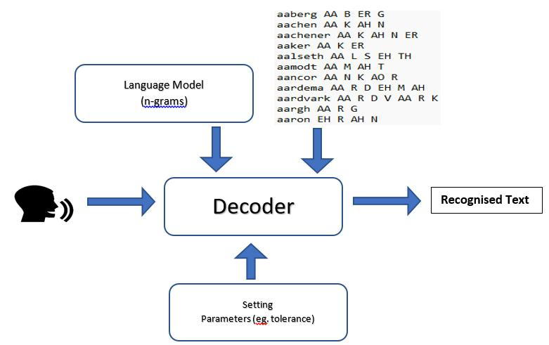

<b>
Fig. Overview of Sphinx plugin Speech to Text operation
</b>

_Drawbacks_: 
  * Need to add phonemes (vocabulary) for the words to get recognised
  * Performance is not good for text with 2 or more words

<h2>Whisper Speech-to-Text Unreal Engine Plugin</h2>

Reference : [Whisper Cpp](https://github.com/ggerganov/whisper.cpp) 
GIT : [../blob/main/SpeechRecognition.zip](https://github.com/Srikanth635/IAI/blob/main/SpeechRecognition.zip)

_Libraries Used_:
  * SDL2
  * Whisper (C++)
  * Standard Library C++ 17
  * Containers : Array, Vector, Map, Set
  * Streams : fstream, iostream, sstream
  * Concurrency : thread, mutex, atomic

  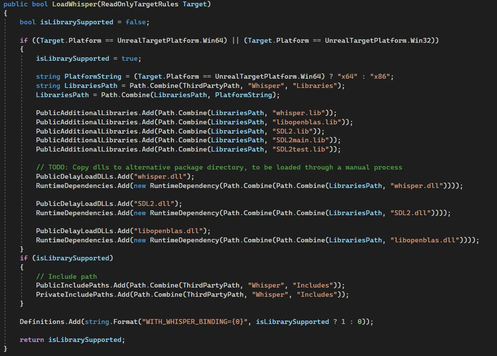

<b>
Fig. Code snippet inside Build.cs of speech-to-text unreal engine plugin
</b>

Inside 'SpeechRecognition\Source\SpeechRecognition\Private\ MySpeechWorker ', functions to record audio, scaling, filtering are found.

Processed audio is passed on to  whisper network to get transcripted text as output.

  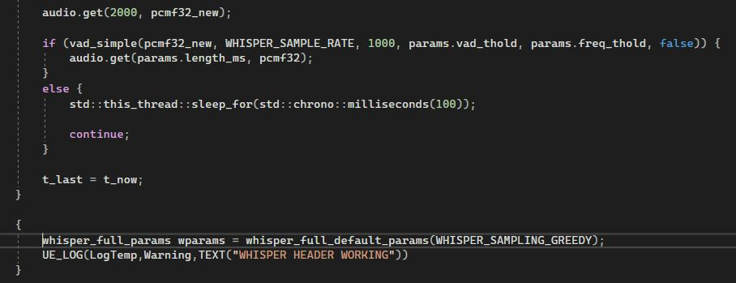

<b>
Fig. Code snippet to retrieve audio buffer and invoke whisper for transcriptions
</b>

_Drawbacks_: 
  * Speed : The speed of transciption is greater than 8 secs which is not reliable
  * Accuracy : Obtained transcriptions doesnt match the speaker utterances always

<h2>REST API (Unreal Engine) – Flask</h2>

GIT (USemLog) : [../USemLog/tree/SpeechRecord](https://github.com/AbhijitVyas/USemLog/tree/SpeechRecord) 
GIT (Flask Python file) : [../IAI_USEMLOG_REST_Speech/blob/master/voice.py](https://github.com/Srikanth635/IAI_USEMLOG_REST_Speech/blob/master/voice.py) 

* _FLASK_ :
  * Flask, a lightweight framework for building web applications in Python
  * Used Python’s PyAudio to read in audio data with required format, rate etc.,
  * Used routes to map URLs to functions that handle the requests
  * Listened for incoming HTTP requests and responds with appropriate HTTP responses (transcriptions)
  
* _Unreal REST API_ :
  * Used Unreal engine’s C++ HTTP modules to raise API requests (start and stop recordings)
  * Used parsing libraries (JSON) to parse the received response from flask

_Libraries and Tools Used_ : 
  * Unreal Engine (4.27,5.1.1)
  * USemlog Plugin
  * C++ Libraries (STL:Containers, JSON, HTTP)
  * PyCharm (Flask API)
  * Python Libraries (PyAudio, Whisper, os, wave, datetime, torch, threading)

  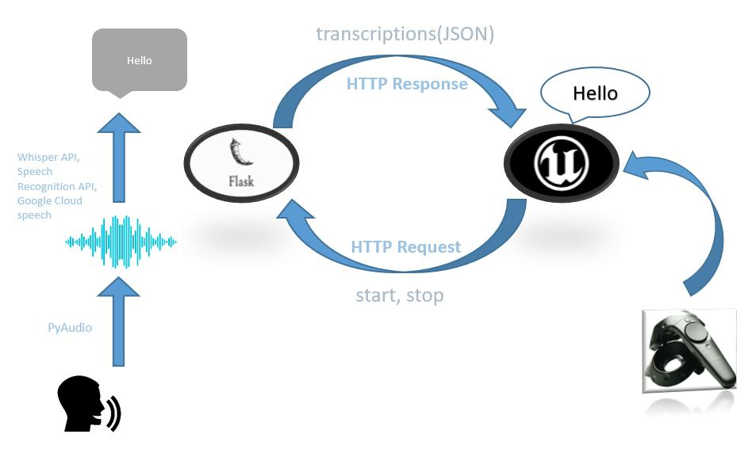

<b>
Fig. Overview of Speech to Text Operation in ‘RobCoG’ using FLASK API
</b>

  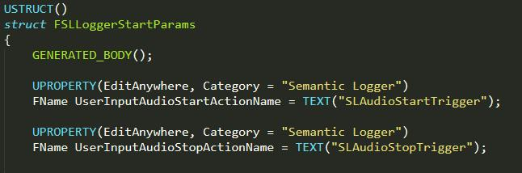

<b>
Fig. Code snippet of variables to facilitate controller mappings
</b>

  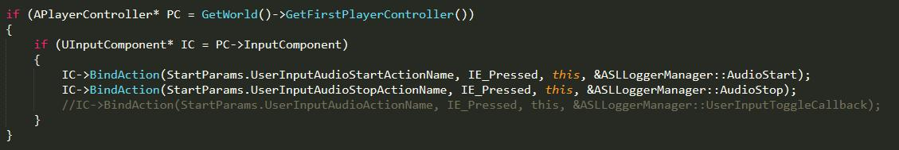

<b>
Fig. Code snippet of controller mappings to functions
</b>

  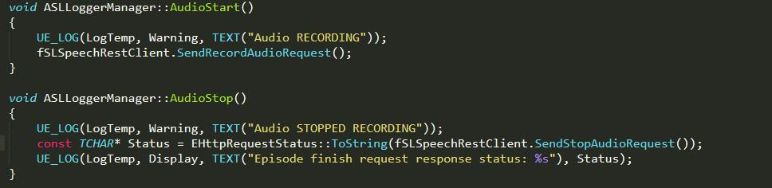

<b>
Fig. Code snippet of mapped functions calls definition
</b>

  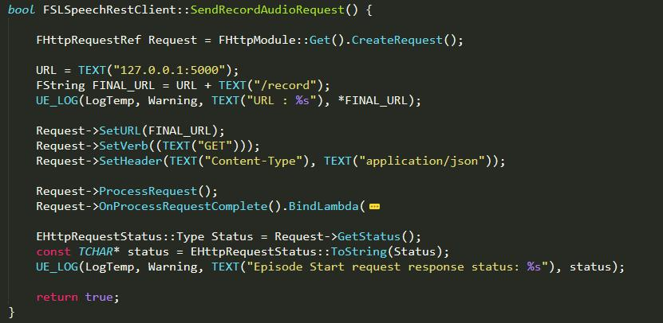

<b>
Fig. Code snippet of function to send start audio signal API request
</b>

  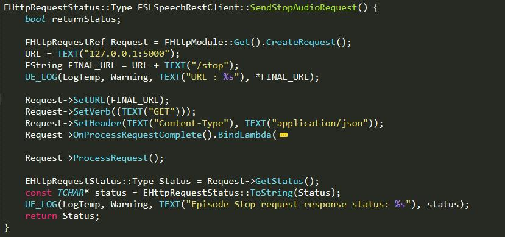

<b>
Fig. Code snippet of function to send stop audio signal API request
</b>

  
